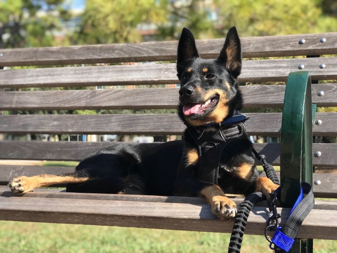
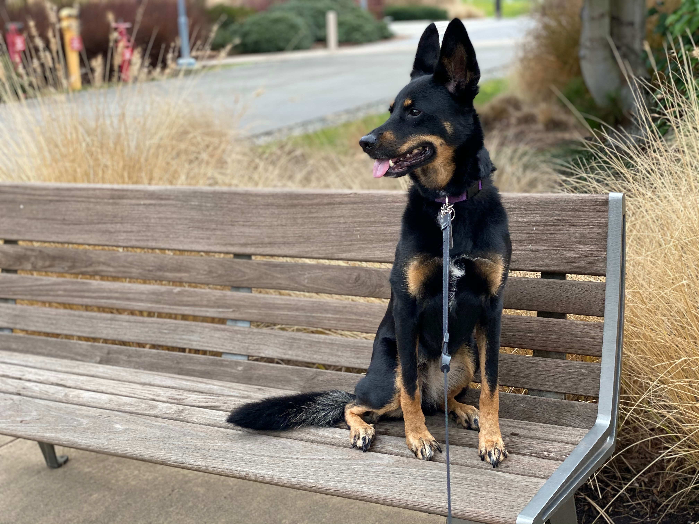

# Murphy (she/her)

Murphy the dog. Adopted in fall 2017. Unknown birth date (~2015) canonically celebrated on October 18th.

Description:

- mixed breed; looks like a small german shepherd
- mostly black fur, some brown/white
- ~35 lbs (has been from ~30 up to ~38)
- shy but sweet

## vet

see [vet info](vet.md)

## food

Blue Buffalo -- Adult -- Chicken and Brown Rice Recipe

~1 cup twice per day

Murphy will not overeat her own food and it can be left out. However, I tend to feed her twice per day to avoid any food aggression toward Nix.

## potty

Murphy should go out at least 3x/day -- morning, afternoon, and night.

## exercise

Murphy doesn't need too much exercise.

## pictures

