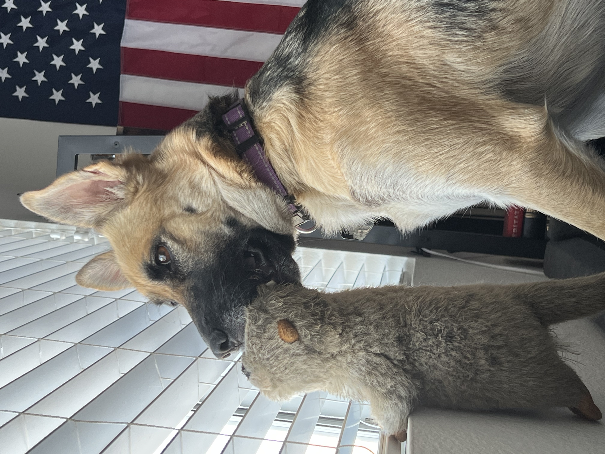

# Nix (she/her)

Nix the dog. Adopted in March 2023. Unknown birth date (~2021) canonically celebrated on February 21st. Full name at adoption was Phoenix, but I shortened it to Nix.

Description:

- mixed breed; looks like a small german shepherd
- black and brown fur; weird tail
- ~38 lbs
- energetic

## vet

see [vet info](vet.md)

## food

Blue Buffalo -- Adult -- Chicken and Brown Rice Recipe

~1 cup twice per day

Nix will not overeat her own food and it can be left out. However, I tend to feed her twice per day to avoid any food aggression from Murphy.

## potty

Nix should go out at least 3x/day -- morning, afternoon, and night.

## exercise

Nix is very energetic and should have a lot of exercise.

## pictures

